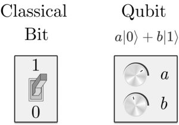
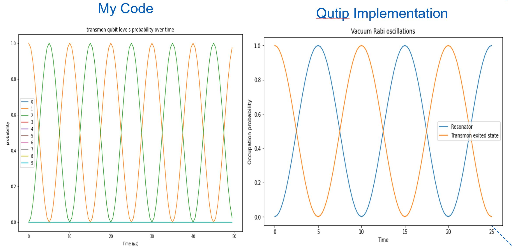
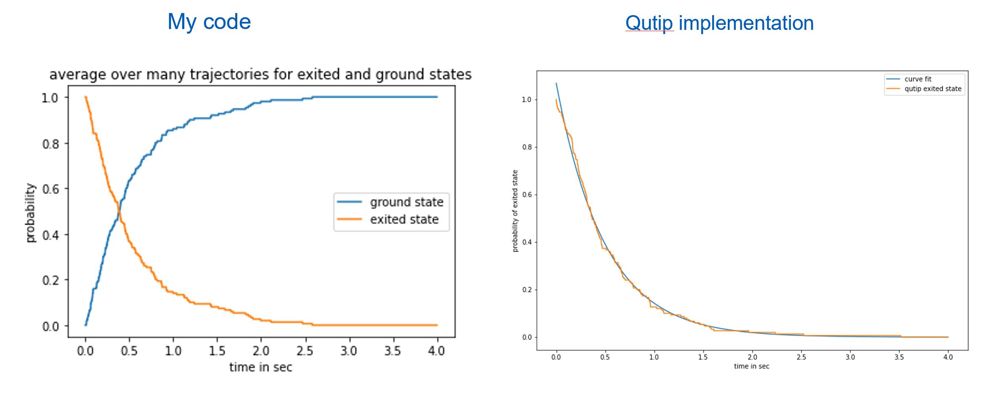

## Superconducting qubit and it's dynamics using QMCWF

### Introduction

Every phenomena is fundamentally quantum in nature and as we go to tiny world that becomes more obvious.So why don't we use quantum physics based computation. we have made huge progress in terms of understanding light-atom interactions even at quantum level and has given field of cavity quantum electrodynamics. Here I will talk about one such interaction between Superconducting Qubit for our case it will be Transmon qubit and superconducting 3D cavity which can store quantised light. I will talk about realization of qubit and  see the dynamics of our coupled transmon and resonator. 

To understand Qubit let’s start with classical Bit. Bit is the basic unit of information in normal computers, which can be represented by $|0>$ and $|1>$. So, when we say there is a single bit of information, it means we have either $|0>$ or $|1>$, which are shown in the fig.~1 as on/off switch. We can’t have both $|0>$ and $|1>$ at the same time. 

Quantum Bits,\url{https://brilliant.org/practice/quantum-bits/}

When we say we have a single qubit, it will be represented as superposition of both $|0>$ and $|1>$,
\begin{equation}
|\psi> = a|0> + b|1> 
\end{equation}
 
Where a and b both are complex numbers and square of the both amplitudes $|a|^2 $ and $|b|^2$ tell us the probability of the given Qubit to be either in $|0>$ or $|1>$ state. 
So here  $|a|^2$ tells us the probability of the Qubit in the $|0>$ state, while $|b|^2$ tells the probability of the Qubit in $|1>$ state.we can think of it as a regulator where it can be both the mixture of $|1>$ and $|1>$. One more important thing to say about a and b is that, other then amplitude of the states it also gives us the relative phase of the two states. 
Here, a and b are constrained by the below relation,
$ |a|^2+|b|^2=1$, which simply means that total probability to be in one of the two state is 1.From the above description we can say that, qubit is the coherent superposition of the both states.There is one more way to write this in spherical co-ordinates
\begin{equation}
|\Psi> = cos\left(\frac{\theta}{2}\right) |0> + e^{i\phi} sin\left(\frac{\theta}{2}\right) |1> 
\end{equation}

Quantum basis states, \url{https://www.quantum-inspire.com/kbase/qubit-basis-states/}

We can think of the qubit as a vector on this Bloch Sphere that is defined by the polar angel$\theta$ and azimuthal angel$\phi$. $\phi$ gives the phase relation between two states of the qubit.So when we talk about two Qubits, the state of which would be given as,
$|\Psi> =a|00> + b|01> +c|10> +d|11> $,
Where a,b,c,d are all complex numbers and square of the amplitudes gives us the probability of the states. Hence, two qubit state needs $2^2 = 4$ amplitutes to describe it's complete state. Contarary to that classical two bits would be one of the state of the given four states ${|00>,|01>,|10>, |11>}$. So, to store two qubits we will need four classical two bits in simple words and that number grows exponentially as $2^N$. 

some of the major advantage of using qubits for computations are given here in simple words. If we have a system of N qubits, the quantum state of such qubit state can be represented by $2^N$ amplitudes. When $N= 500$, the qubit state is represented by the $2^{500}$  amplitudes.  This number is more than the estimated number of atoms in the universe. Trying to store this many complex numbers would be impossible in classical computers. However nature manipulates such enormous number of data, even for the system containing only a few hundred atoms. It is as if nature keeping $2^{500}$ hidden pieces of scratch paper on the side, on which it performs it’s calculations as the system evolves.

### Resonator 

Let's talk about the **Resonator** first. There are many ways to implement the resonator which is just a harmonic oscillator at the end. For our case we can either use the 3D cavity or Superconducting coplanar waveguide (CPW) resonator. we also call it Microwave resonator because of the resonance frequency of it. Around resonance, the properties of a CPW resonator can be approximated by LCR lumped element[1]. The LCR model is useful to get an intuitive understanding of the resonator properties. If we write the hamiltonian of the resonator

\begin{equation}
H_r = \frac{1}{2} CV^2 + \frac{1}{2} LI^2
\end{equation}
where $V=Q/C$ and $I = \dot{Q}$ then the equation will become\cite{CQED},
\begin{equation}
H_r = \frac{L}{2} \dot{Q}^2 + \frac{1}{2}C Q^2 
\end{equation}

we can connect above equation with the hamiltonian of the simple harmonic oscillator by putting $p= L\dot{Q}$ and $Q=x$. So, the new hamiltonian will be same as SHO:
\begin{equation}
H_r = \hbar \omega_r\left(a^+a +\frac{1}{2}\right)
\end{equation}
where $<a^+a> = <n> = n$ is the average photon number. In our code we have decided to assumed $\hbar = 1$ and $\omega_r =  2 . \pi$.

### Transmon qubit

Now, for the **transmon** part, superconductivity allows to introduce nonlinearity in quantum electrical circuits while avoiding losses. Indeed, the Josephson junction is a nonlinear circuit element. We can write the hamiltonian for the transmon qubit(one type of the superconducting qubit) as,

\begin{equation}
H_T = \frac{(Q - Q_g)^2}{2C_{\Sigma}} - E_J cos(2\pi\frac{\Phi}{\Phi_0})  \\
H_T = 4E_C(n - n_g)^2 - E_J cos\phi
\end{equation}

Here,charging energy $E_C = e^2/2C_{\Sigma}$ and $E_J = \Phi_0 I_c/2\pi$. So, basically when the ration of $E_J/E_C$ is very large, typically in the order of 10 we get the transmon qubit. Above transmon qubit is multi-level system but what we want is just the two level system so that we can use it as a qubit. One of the simplest way to do that is truncate the all the levels above first ecited state. We can do that because we have the anharmonisity in level seperation[2]. So let's do that. First we write the $\phi$ and $n$ in terms of $\sigma$ and $\sigma^+$ [3],

\begin{equation}
\phi = (\frac{2E_C}{E_J})^{1/4} (\sigma^+ + \sigma^-) 
\end{equation}  

\begin{equation}
n = \frac{i}{2} (\frac{2E_J}{E_C})^{1/4} (\sigma^+ - \sigma^-)
\end{equation}

Using these expressions finally leads to,

\begin{equation}
H_T = \sqrt{8E_C E_J}\sigma^+\sigma - \frac{E_C}{12} (\sigma^+ + \sigma^-)^4  
\end{equation}

\begin{equation}
H_T = \hbar \omega_a \sigma^+\sigma - \frac{E_C}{2} \sigma^+\sigma^+bb
\end{equation}

In the second equation above have used the Rotating wave approximation. Now second term in the above equation tells us about the anharmonicity in transmon energy levels which we will get reed of, Hence our final hamiltonian for the Transmon will look like,

\begin{equation}
H_T = \hbar \omega_a \sigma^+\sigma^-
\end{equation}

### Coupled transmon and resonator

Now, lets couple this two together, the resonator and the transmon, the simplest way to do that is under RWA approcimation, which will give us the Jaynes-Cumming Hamiltonian[3] as shown below,

\begin{equation}
H_{JC} = H_r + H_T + \hbar g (a^+\sigma^- + a\sigma^+) 
\end{equation}

here $g$ is the coupling constant. When the two systems are couples (single transmon qubit with single mode of the oscillator) we can see interisting dynamics in it. First thing to note is before coupling term added, what we will see as the energy levels are degenerate. which means the $|0e>$ (transmon in the exited state and the resonator in the ground state) and $|1,g>$ (transmon in the ground state and resonator in first exited state means with single photon) are degenerate. But, after adding the coupling term they will become non degenerate[3]. Now, suppose we start in the $|0e>$ state of the system, because of the coupling term what the hamiltonial will do is, it will oscillate between the $|0e>$ and $|1g>$ at $2g$ frequency[3]. This is known as Vaccum Rabi oscillations. This happens when the detuning ($\Delta$) between the qubit and resonator frequancy is zero, means both frequancies are same. so we will get complete oscillations where at one point the probability of being in the exited state would be zero. 

But, what happens if detuning ($\Delta$) is not zero, In such cases we will still get the oscillations but they won't be same as above case. chances of zero probability for exited will never be completely zero. another thing that will happen is the oscillation frequency will increase. And if the detuning is too big, there won't be much of a coupling between the qubit and resonator and we won't see any oscillations as if it is decoupled. For the initial part of my project is to show dynamics of the system. 

In this project my goal is to implement transmon qubit and resonator which are coulped with each other and see it's dynamics. eventually i will implement the transmon qubit in contact with the environment(Heat bath) and see how it's dynamics work out. As a initial goal I wanted to see how it's working and how in a simplest way I can implement it without using Quantum Monte Carlo wavefuction method. That's exactly what I have done in the first part of the milestone to implement the Jaynes-Cumming model using density matrix and it's time evolution in the eigun states basis.   

let's see it mathematically (**Algorithm**) to understand my code,

* initialize the state $|\Psi>$ and convert it into density matrix $\hat{\rho} = |\Psi><\Psi|$ by taking outer product.
* define the hamiltonian by making sure the operator of the hamiltonian operates on the right state (either transmon or resonator). To achieve that we use the Kronecker product (np.kron(a,b)) of the individual operators to take care of that.
* find the eigunvalue and eigunstates of the hamiltonian.
* we will use this eigunstates of the hamiltonian to do the time evolution. For that first we need to transform this initial density operator $\hat{\rho}$  to basis of the hamiltonian. We will do that by using the formula from quantum mechanics, $\tilde{\rho} = R^+ \hat{\rho} R$. where $R$ is the matrix made of the eigunstates of the hamiltonian. 
* now we can do the time evolution which can be given as $\tilde{\rho}(t) = exp(-i H_{JC} t) \tilde{\rho(0)} exp(i H_{JC}t)$. which we can achieved by the matrix maltiplication in a interisting way.
* once time evolution is done, transfor the density matrix from $\tilde{\rho}$ to $\hat{\rho}$ using $\hat{\rho}(t) = R \tilde{\rho} R^+$.
* so now we have the final density matrix which we can use and plot over time. 

One important thing to notice here is that we have some modules availible to do that for us, like qutip and qiskit. but since my goal is to understand the physics and then implement the code from what I have learned in Comp Physics 2, I did it all by myself. If we do the comparision between this two I noticed that both of them are agreeing precisely with each other. 

* In the above image we can see that oscillation frequency are same in both cases. 
* probability of getting from exited to ground is nearly same as well.

### coupling transmon to environment (Heat Bath)
Interisting thing to do now is what will happen if I add more resonator modes coupled to the transmon qubit. In this case the dynamics get much more richer as hamiltonian becomes too big and much more involved. with adding each mode of the resonator we have to do the tensor product, which is not a right way to do the numerical analysis. other then that the hamiltonian becomes to big to get solved easily. 

Here for the multimode resonator or the environment hamiltonian will look like[4],

\begin{equation}
H_{int} = \hbar \sum_j g(a^+ \sigma^- + a \sigma^+)
\end{equation}

initialy we can try to solve the hamiltonian by solving system-reservoir Schrodinger equation,

\begin{equation}
\dot{\rho_{sr}} = -\frac{i}{\hbar}[H_{total}, \rho_{sr}]
\end{equation}

but as we know it is impossible to keep track of all the degrees of freedom of the modes and we are interested only into evolution of the qubit so for that perpose we will trace over the reservoir and try to write the equation in terms of density matrix of the transmon qubit which is also known as master's equation, which will look like below,

\begin{equation}
\frac{d\rho}{dt} = -\frac{i}{\hbar}[H_T, \rho]+ L_{relax}[ \rho]    
\end{equation}

\begin{equation}
L_{relax} = -\frac{\Gamma}{2} (\bar{n} + 1)(\sigma^+\sigma^-\rho + \rho \sigma^+ \sigma^- - 2\sigma^-\rho\sigma^+) -\frac{\Gamma}{2}\bar{n}(\sigma^-\sigma^+\rho + \rho \sigma^- \sigma^+ - 2\sigma^+\rho\sigma^-)
\end{equation}

where $\bar{n}$ is the thermal occupation of the bath. and $H_T = \hbar \omega_a \sigma^+ \sigma^-$.Above equation is also known as Lindblad master equation. My goal in this part is to solve this density operator to get the dynamics of the transmon qubit. here the coupling of the transmon to environment (infinite harmonic oscillator modes) results into the decoherance of it. which means eventually the transmon will loose it's superposition and behave more like a mixed state where it does not have quantum behaviour. There are many ways to solve the above problem analytically also numerically. For example we can use the density matrix of the transmon and solve the PDE of four elements of the density matrix and from that we can get the evolution. But our pupose we will need to use quantum trajectory to solve the problem numerically. One advantage of the trajectory method is we don't need to solve 2*2 matrix and evolve it, which is $N^2$ order. while in quantum trajectory we use wavefunction insted of density matrix and we need to solve this with the order $O(N)$. The above density matrix master equation will look like 

\begin{equation}
\frac{d\rho}{dt} = -\frac{i}{\hbar}\prime{[H_{eff}, \rho]}+ \Gamma \sigma^- \rho \sigma^+   
\end{equation}

\begin{equation}
H_{eff} = (\hbar \omega_a - i \frac{\Gamma}{2})\sigma^+ \sigma^- 
\end{equation}

here $H_{eff}$ is non hermitian, the second term of the master equation accounts for the "quantum jump" from the exited state to ground state. while first term is for the decay of the exited state[5]. This division of the relaxation effects into decay and quantum jumps is useful for numerical solutions to the master equation. One can simulate the trajectory of the transmon initially in the exited state by a deterministic decay by the non hermitian hamiltonian, followed by a quantum jump. Averaging over a many realization of this random event gives the solution. This method is known as **quantum Monte-Carlo wave function simulation** [5]. Either to choose jump or the non-hermitian evolution depends on the the probability of each one of it happening. and we will implemnt probability using the random variable. Sometime we will have more then one jump operators, for example exitation jump operator and emission jump operator, in such cases each jump operator also has different probabilities to happen. for that also we need random variable to choose between them.

The **algorithm** for QMCWF method : 

* first, let's assume that we have single jump operator (just to simplify the algorithm little bit). for example in spontaneous emission case $L = \sqrt(\Gamma)\sigma^-$. 
* now initial state is given by $\left|\psi_0\right>$
* choose very small time step $dt$, calculate jump probability for that time step 
\begin{equation}
dp(t) = \left<\psi(t)| L^+L | \psi(t)\right> = \Gamma dt \left<e|\psi(t)\right>
\end{equation}
* now simulate the probability with the random number generator,

  * pick a random number $\epsilon, 0< \epsilon < 1$

  * if $\epsilon$ < $dp(t)$, jump $|\tilde{\psi}(t)> = \sqrt{\Gamma}\sigma^-|\psi(t)>$

  * or $|\tilde{\psi}(t + \Delta t)>  = \exp{(\frac{-i}{\hbar} H_{eff}\Delta t)} |\psi(t)>$

* renormalize $|\tilde{\psi}(t+ \Delta t)>  =  \frac{|\tilde{\psi}(t+ \Delta t)>}{|| |\tilde{\psi}(t+ \Delta t)> ||}$

* go to step 3 and repeat untill final time t.

* this is for a single trajectory

Above algorithm is simplified for the single jump operator in the case of spontaneous emission where the intial state is exited state $|e>$. If we have two or more jump operators then we will need to use random number two times, one for the jump or no-jump and one for which jump, to get the trajectory. Once we get many such trajecotries we can average over them to get the final answer that will converge to solution of the master equation. 

I have run over three different scenarios. fisrt is for spontaneous emission with both mine and qutip implementation also, I did one where I have two jump operators (exitation and emission), third scenario is qubit is driven under external resonant wave so that we get dampled driven rabi oscillations. 

for the first case I have shown the comparison below, 

Here as you can see the both implementation gives nearly same answer. My code gives the $\gamma = 1.929$ while qutip gives $\gamma = 2.013$, both are close to theoretical value $\gamma = 2$. other results we can see in the notebook files.

 
 

### Referances

[1]. Goppl, M., A. Fragner, M. Baur, R. Bianchetti, S. Filipp, J. M. Fink, P. J. Leek, G. Puebla, L. Stefen, and A. Wallraff, 2008, J. Appl. Phys. 104(6), 113904, URL http://dx.doi.org/10.1063/1.3010859.

[2]. Koch, J., T. M. Yu, J. Gambetta, A. A. Houck, D. I. Schuster, J. Majer, A. Blais, M. H. Devoret, S. M. Girvin, and R. J. Schoelkopf, 2007, Phys. Rev. A 76(4), 042319, URL http://link.aps.org/abstract/PRA/v76/e042319.

[3]. Blais, A., Grimsmo, A., Girvin, S., & Wallraff, A. (2020). Circuit Quantum Electrodynamics.

[4]. Meystre, P., Sargent III, M., 1999, *Elements of Quantum Optics*(springer edition)

[5]. Mølmer, K., Castin, Y. and Dalibard, J., J. Opt. Soc. Am B, 10, 524 (1993).

[6]. Gleyzes, S., et al., Nature 446, 297 (2007)

[7]. Deutsch, I., lecture on quantum trajectories, retrieved from \url{http://info.phys.unm.edu/~ideutsch/Classes/Phys566F10/Lectures/Lecture22.pdf}

[8]. 